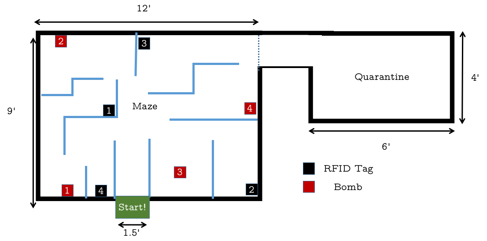

# ARC IoT Competition for ATMOS 2017 - Bomb Defusal

## Summary

* To use an autonomous or manually controlled robot to move cubes from pre-marked areas in the Arena to pre-marked safe zones for depositing them.
* Points are awarded for defusing and displacing a defused bomb to a safe area. The team with the most points at the end of a round wins.

## Competition Arena

The Arena will consist of two areas:

### Bomb Maze

* The bombs in the Arena are scattered throughout a maze. This maze is open from the top and can be seen by the participants controlling the bot.
* The bombs are cardboard boxes of cubes of a consistent size of 5cm x 5cm x 5cm. The bombs are labelled with numberr and mounted with an LED showing the state of the bomb. The bomb may *only* be moved when it has been defused.
* The bomb maze section has several RFID tags scattered throughout it, each of which correspond to a bomb.
* The robot must scan this RFID tag to defuse the bomb. The value scanned off the RFID tag is to be sent to a server listening on an IP address speicifed at the beginning of the competition. The server will then send an numeric instructions to the robot.

The server will be provided by the organisers.

### Bomb Quarantine

* After the bomb has been defused, it has to be moved to a 'quarantine' separated from the maze. On placing the bomb here, the participant will be awarded points. Please see the 'Gameplay' section for more details on the scoring system.

*This map is purely for representational purposes only. The number of and placement of bombs, RFID tags, and maze pattern is subject to change. The dimensions of the Competition Arena will be the same as illustrated here.*

## Bot Specifications

### Technical Specifications

* Max Size: 300mm x 300mm x 300mm (l x b x h)
* Max Weight: 5kg
* Max Operating Voltage: 12V
* Power Supply Unit: Onboard battery (Li-Po, Li-Ion NiMH, NiCd, or Lead-acid)
* Wireless Communication: 2.4 GHz RF, WiFi, Bluetooth, NRF, or ZigBee can be used

### Other Requirements

* Commercially available ready-made robots are not allowed.
* Each team is allowed to have only one robot.
* The robot may be autonomous or manually controlled. If manually controlled, the bot must be controlled over wireless **only**.
* The robot must have an appendage for lifting and placing the bomb without pulling/pushing or damaging the bomb in any way. This can be any mechanical setup.
* There are no restrictions on the sensors. However, to complete the competition, each robot must have a WiFi module and an RFID scanner onboard.

## Gameplay

Each bomb has four possible states:

* **Armed** - when the bomb has not been defused.
* **Defused** - when the bomb has been defused by carrying out the instructions on the RFID tag, but not moved to the quarantine area.
* **Quarantined** - when the bomb has been successfully placed in the quarantine area after being defused.
* **Exploded** - happens when the bomb has been moved when in an Armed state. This will result in a penalty.

### Individual Round

The robot will start from a box in the Arena. The participant must ensure that their robot is connected to the competition WiFi. The bombs will be placed by the competition organisers in the Arena.

The robot must search for an RFID tag in the Arena. This must be scanned by the robot. On scanning, the server will return a series of numbers which correspond to an instruction.

There can be three types of instructions for the bombs:

1. **X** - The bomb numbered 'X' is defused and can be moved to the quarantine area.
2. **X X** - The bomb numbered 'X' can be moved even after another tag is scanned consecutively.
3. **A X Y...Z** - The bomb numbered 'A' can only be defused once the bombs numbered 'X', 'Y' till 'Z' are defused. Once the pre-requisite bombs are defused, 'A' can be moved to the quarantine area. An example is that an instruction '5 9 2 3' means that bombs 9, 2, and 3 must all be defused and quarantined before 5 can be quarantined.

Type-1 bombs **must** be quarantined right after defusing them. If another RFID tag is scanned before defusing it, the bomb's state will reset (i.e., it must be defused again) and a penalty will be imposed.

Type-2 and Type-3 bombs do not have this restriction. Nevertheless, if **any** bomb is Armed (not defused) when moved, the bomb will explode and penalty points be awarded.

Each team gets a total of **5 minutes** in the Arena to get as many points as they can.

#### Scoring System

* Type-1 Bomb Defusal: 20 points
* Type-2 Bomb Defusal: 50 points for defusing the bomb, 10 points for defusing each of the pre-requisite bombs
* Type-3 Bomb Defusal: 10 points
* Quarantining a bomb (any type): 50 points

#### Penalty

* Lifting an Armed bomb: -50 points and the bomb cannot be defused again
* Scanning two tags consecutively for a Type-1 bomb: -10 points

### Knockout Round

After the individual rounds for all the teams are completed, the top four teams are selected for the Knockout Round.

The rules regarding bomb defusal are the same as in the Individual round. However, in the Knockout Round, **two teams** play at once.

One team gets **5 minutes** to **place** the bombs in the arena and the other team gets **5 minutes** to defuse these bombs as per the rules in the Individual round. After this, the teams placing the bombs and defusing the bombs are **reversed** and the game is played again. The team with the highest cumulative score of setting and defusing wins.

#### Scoring System

##### Placing Bombs

* Points awarded = Number of Bombs left after the round is over x 50 points

##### Defusing Bombs

* Type-1 Bomb Defusal: 20 points
* Type-2 Bomb Defusal: 50 points for defusing the bomb, 10 points for defusing each of the pre-requisite bombs
* Type-3 Bomb Defusal: 10 points
* Quarantining a bomb (any type): 50 points

#### Penalty

##### Placing Bombs

* No penalties

##### Defusing Bombs

* Moving an Armed bomb: -50 points and the bomb cannot be defused again
* Scanning two tags consecutively for a Type-1 bomb: -10 points

## Rules and Guidelines

The organizers reserve the right to change any of the above said rules, at any time.
Changes will be notified on the website and Facebook page. It is the participant’s
responsibility to stay updated.

### Setup Time

* The participants will get 10 minutes of setup time for calibration and testing prior to the competition, according to a schedule that will be made available at the start of the event.
* Ensure that all of the vehicle's sensors, especially the WiFi module and wireless control are working properly.
* The bot must be placed in the starting point on the Arena, at the beginning of each round.

### Competition

* Participants will not be permitted to enter the Arena or touch any of the bombs inside or outside the Arena, during a match.
* A robot can only move one bomb at a time.
* The robots can come in contact with the walls but should not damage it.
* Participants should *not* dismantle their robots before the competition results are announced as the robots might need to be checked by the organizers at a later stage to ensure that the participants have not violated any of the rules.
* In case of any dispute, the verdict of the judges is final.

### Disqualification

A team may be disqualified due to, but not limited to the following:

* The robot fails to meet any of the criteria in the Bot Specifications section.
* The robot damages a bomb when moving it.
* The participating team is not ready in time for the start of their turn.
* The robot damages the Competition Arena.

## Paritcipation

* Participants can register in teams of 1-4 people.
* Students from different educational institutes can form a team.
* All participants must have a valid ID card from their educational institute.

## Contact

Arnav Dhamija
Phone: 9900855740
E-mail: arnav.dhamija@gmail.com

Yashdeep Thorat
Phone: 9010712068
E-mail: yashdeep97@gmail.com

Yohan MR
Phone: 9640553127
E-mail: yohanmr2102@gmail.com
